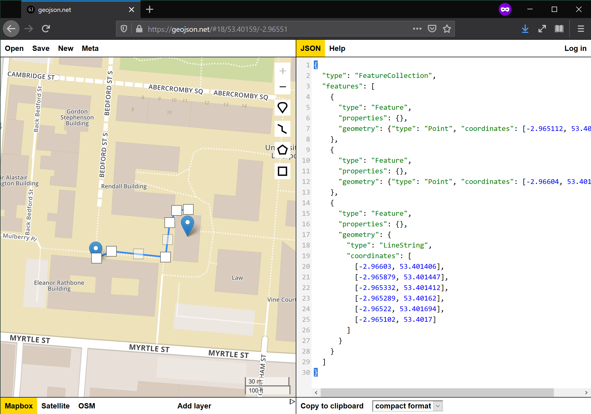

# Lab 3 - Creating, manipulating, and integrating web geospatial data

In this lab, we will explore and familiarise with some of the most common data formats for web mapping: `GeoJSON` and `Mbtiles`. To follow this session, you will need to be able to access the following:

- The internet
- [QGIS](https://qgis.org/en/site/). Any version should work in this context, but if you are installing it on your computer, QGIS 3.10 is recommended
- A Python installation such as the "Geographic Data Science Stack 2019" in the University of Liverpool computers, or the `gds_env` Docker container in your own machine (see [here](http://darribas.org/gds19/software.html) for instructions) 

## `GeoJSON`

To get familiar with the format, we will start by creating a GeoJSON file from scratch. Head over to the following website:

> [https://geojson.net](https://geojson.net)

In there, we will create together a small example to better understand the building blocks of this file format. 



We will pay special attention to the following aspects:

- Readability
- Coordinate system
- Ability to add non-spatial information attached to each record
- How to save it as a file

**EXERCISE**

Create a `GeoJSON` file for the following data and save them to separate files:

- Your five favorite spots in Liverpool
- A polygon of what you consider to be the boundary of the neighbourhood where you live and the city centre of Liverpool. Name each
- A route that captures one of your favorite walks around the Liverpool region

If you are comfortable, upload the files to Microsoft Teams to share them with peers.

With the files at hand, we will then learn how to open them in Python. Start Jupyter Lab session and open a new notebook so you can keep record of what you do (rename it to something you will remember, like `web_mapping_lab_03.ipynb`).

Then let's start by importing `geopandas`

```python
# This ensures plots and maps render in the notebook
%matplotlib inline

import geopandas
```

Now, place the `.geojson` files you have created in the same folder where you are storing the notebook, or somewhere reachable. For this example, we will assume that the file is called `test.geojson` and it is stored in the `figs` folder, accessible from the same location where the notebook is. We can read the file as:

```python
db = geopandas.read_file("figs/test.geojson")
```

We can inspect the file to see what it contains:

```python
db.head()
```

```
           Nombre                                           geometry
0  Roxby Building                        POINT (-2.965112 53.401534)
1            None                         POINT (-2.96604 53.401377)
2            None  LINESTRING (-2.96603 53.401406, -2.965879 53.4...
```

If you are familiar with `GeoDataFrame` objects, this is exactly it, read straight from a `GeoJSON` file (if you need a refresher, you can check out [Lab 3 of the GDS'19 course](http://darribas.org/gds19/labs/Lab_03.html)).

Because once read, it behaves exactly like any of `GeoDataFrame` objects, we can then write it out to any other file format supported by `geopandas`. For example, we can create a Geopackge file with the same information:

```python
db.to_file("figs/test.gpkg", driver="GPKG")
```

## `Mbtiles`
