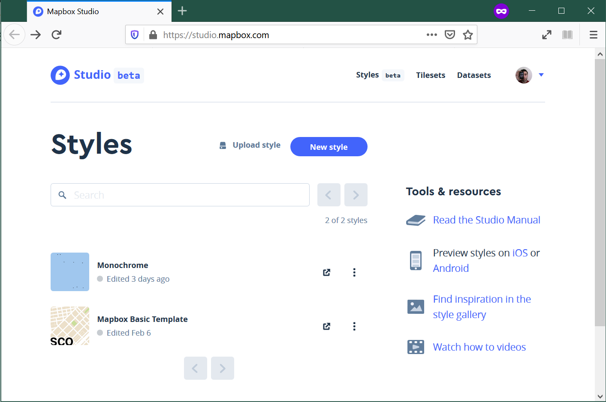

# Lab 7 - Map Design

In this lab, we will put to use some of the ideas and concepts we have learnt about map design. We will do so using [Mapbox Studio](https://www.mapbox.com/mapbox-studio/), a tool that will allow us to control almost any thinkable aspect of a map.

As we go through the practicalities, remember the concepts that inspire map design, which we have outlined in the [lecture slides](../slidedecks/lecture_07.html). The challenge here is not in learning the software, but in being able to translate abstract notions of design into an applied context.

To complete this lab, you will require the following:

- The internet
- An active Mapbox account

## Mapbox Studio

Let's get starting by logging into our Mapbox account and opening up the Studio at:

> [`https://studio.mapbox.com/`](https://studio.mapbox.com/)

You should see something like this:

To explore what is possible, we will create a new style. Click on the "New Style" button and pick the "Monochrome" option. Select the color you prefer. This will load the Studio editor, where we will spend most of this session.

The Studio is structured around three main panels: styling on the left, the map canvas, and the toolbar at the top.

[`Source`: Mapbox](https://docs.mapbox.com/studio-manual/reference/styles/#style-editor)

## Exercise

## Presentation
