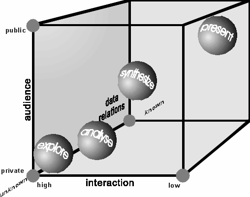
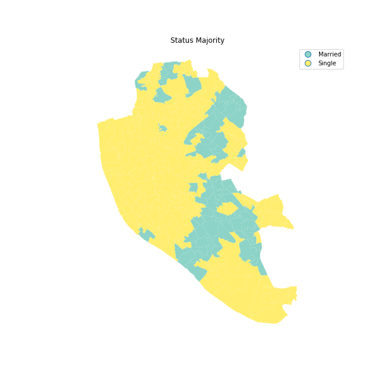

% Web Mapping & Analysis
% Good (Web) Maps
%[Dani Arribas-Bel](http://darribas.org)

# Today

- Visualisation
- (Web) Maps
- Choropleths

#
## Contributed Links

#
## Visualisation

## Requirements of visualisation (Kirk 2016)

Good data visualisation is:

- Trustworthy
- Accessible
- Elegant

#
## (Web) Maps

## Tufte (1983)

*“The most extensive data maps […] place millions of bits of information on a single page before our eyes. No other method for the display of statistical information is so powerful”*

## Designing good maps

Maps can fulfill several needs, looking very different depending on the end-goal

MacEachren & Kraak (1997) identify three main dimensions:

- Knowledge of what is being plotted
- Target audience
- Degree of interactivity

## Map Cube

[`[Source]`](http://cartography.tuwien.ac.at/wordpress/wp-content/uploads/2013/01/cartotalk-corne-van-elzakker.pdf)

#
## Choropleths

## Choropleths

*Thematic map in which values of a variable are encoded using a color
gradient of some sort*

* Encode **value** using the **color** channel
* Values are **classified** into **groups** (bins)
* **Information loss** as a trade off for **simplicity**

## Classification choices

* N. of bins
* How to bin?
* Colors

## How many bins?

- Trade-off: detail Vs cognitive load
- Exact number depends on purpose of the map
- Usually not more than 12

## How to bin?

## Unique values

* Categorical data
* No gradient (reflect it with the color scheme!!!)
* Examples: Religion, country of origin...

## Unique values

## Equal interval

* Take the **value** span of the data to represent and split it equally
* **Splitting** happens based on the **numerical value**
* Gives more weight to outliers if the distribution is skewed

## {data-background=../slides/figs/l01_equal_interval.png data-background-size=contain}

## Quantiles

* Regardless of numerical values, split the distribution keeping the same
  amount of values in each bin
* **Splitting** based on the **rank** of the value
* If distribution is skewed, it can put very different values in the same bin

## {data-background=../slides/figs/l01_quantiles.png data-background-size=contain}

## Other

* Fisher-Jenks
* Natural breaks
* Outlier maps: box maps, std. maps...

## Color schemes

Align with your purpose

* **Categories**, non-ordered 
* Graduated, **sequential** 
* Graduated, **divergent** 

**TIP**: check [ColorBrewer](http://colorbrewer2.org/) for guidance

#
## Tips

- Think of the purpose of the map
- Explore by trying different classification alternatives
- Combine (Geo)visualisation with other statistical devices

#
 Web Mapping & Analysis by <a xmlns:cc="http://creativecommons.org/ns#" href="http://darribas.org" property="cc:attributionName" rel="cc:attributionURL">Dani Arribas-Bel</a> is licensed under a <a rel="license" href="http://creativecommons.org/licenses/by-sa/4.0/">Creative Commons Attribution-ShareAlike 4.0 International License</a>.

